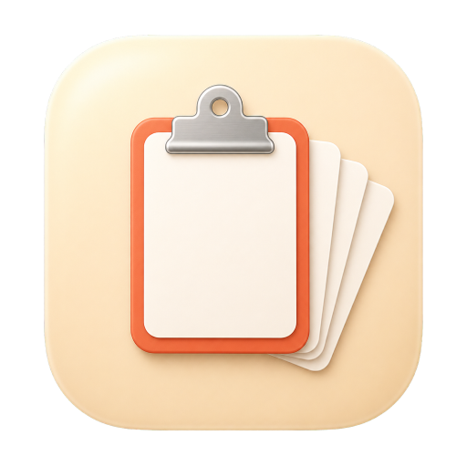

# pizzaClip

macOS 메뉴바 클립보드 히스토리 앱. 복사한 내용을 자동으로 기록하고, 단축키 한 번에 다시 꺼내 씁니다.

<p align="center">
  
</p>

## 무엇을 하나요

- **자동 캡처**: ⌘C / 스크린샷 / Finder 파일 복사를 가만히 기록 (텍스트·이미지·파일 경로)
- **빠른 호출**: `⌘⇧V`로 팝업, 또는 `⌘⌥⌃1~9`로 N번째 항목을 다른 앱에 바로 붙여넣기
- **검색**: 팝업 열고 타이핑하면 SQLite FTS5로 즉시 필터링
- **핀 고정**: 자주 쓰는 항목은 `⌘P`로 상단 고정
- **자동 정리**: 캡 초과 시 오래된 비고정 항목부터 삭제 (기본 200개, 20~500개 설정 가능)
- **개인정보 보호**: 1Password 등 민감 앱과 `org.nspasteboard.ConcealedType` 클립보드는 무시. 모두 로컬 저장, 네트워크 통신 0건

## 단축키

| 동작 | 키 |
|---|---|
| 팝업 열기/닫기 | ⌘⇧V |
| N번째 항목 즉시 붙여넣기 (팝업 없이) | ⌘⌥⌃1 ~ ⌘⌥⌃9 |
| 설정 창 | ⌘, |

팝업 열린 상태:

| 동작 | 키 |
|---|---|
| 위/아래 | ↑ ↓ |
| 붙여넣기 | ↵ 또는 1~9 |
| 항목 삭제 | ⌫ (검색창이 비어있을 때) |
| 핀 토글 | ⌘P |
| 닫기 | ⎋ |

모든 단축키는 Settings → Shortcuts에서 변경할 수 있습니다.

## 권한

처음 실행하면 **Accessibility** 권한을 한 번 묻습니다. 허용하면 항목 선택 시 이전 앱에 자동으로 ⌘V가 입력됩니다. 거부해도 동작은 하며, 클립보드까지는 들어가니 사용자가 직접 ⌘V를 누르면 됩니다. (메뉴바 우클릭 → Grant Accessibility…로 나중에 허용 가능)

## 데이터 저장 위치

`~/Library/Application Support/pizzaClip/` (Settings → Storage에서 변경 가능)

- `db.sqlite` — 텍스트·메타데이터·이미지 썸네일
- `blobs/<uuid>.png` — 원본 이미지 PNG

언제든 Settings → Storage → **Export history to text…** 로 평문 백업 가능.

---

## 개발자용

### 빌드

```sh
brew install xcodegen
xcodegen generate
xcodebuild -project pizzaClip.xcodeproj -scheme pizzaClip -destination 'platform=macOS' build
```

`.xcodeproj`는 gitignore 됨 — `project.yml`이 단일 소스 오브 트루스.

### 테스트

```sh
xcodebuild -project pizzaClip.xcodeproj -scheme pizzaClip -destination 'platform=macOS' test
```

17개 유닛 테스트 (HistoryStore · BlobStore · ClipboardMonitor · Pasteboard).

### 배포 빌드

```sh
./scripts/release.sh
```

테스트 → Release 유니버설 빌드 → `dist/pizzaClip-{버전}.{zip,dmg}` → `~/Applications/` 설치까지 한 번에.

### 요구사항

- macOS 13 (Ventura) 이상
- Xcode 15+
- Swift 5.9+

### 아키텍처

- `pizzaClip/App/` — `AppDelegate`, paths, status item (composition root)
- `pizzaClip/Clipboard/` — `ClipboardMonitor` polling + `PasteboardReader`
- `pizzaClip/Storage/` — GRDB SQLite + FTS5 (`HistoryStore`) + 파일 시스템 (`BlobStore`)
- `pizzaClip/Paste/` — `PasteEngine` (페이스트보드 쓰기 + ⌘V 합성)
- `pizzaClip/Popup/` — `NSPanel` 호스팅하는 SwiftUI `PopupView`
- `pizzaClip/Settings/` — SwiftUI `Settings` 씬 (General / Shortcuts / Privacy / Storage)
- `pizzaClip/Shortcuts/` — `KeyboardShortcuts.Name` 확장
- `pizzaClip/Permissions/` — Accessibility 헬퍼
- `pizzaClip/DesignSystem/` — 컬러·테마 상수
- `pizzaClip/MenuBar/` — 상태바 피자 아이콘 (`Assets.xcassets/PizzaIcon0~9.imageset` PNG 사용)

설계 스펙: [`docs/superpowers/specs/2026-05-21-pizzaClip-design.md`](docs/superpowers/specs/2026-05-21-pizzaClip-design.md)
구현 플랜: [`docs/superpowers/plans/2026-05-21-pizzaClip.md`](docs/superpowers/plans/2026-05-21-pizzaClip.md)
QA 체크리스트: [`docs/qa/checklist.md`](docs/qa/checklist.md)

### 라이선스

개인 사용. 외부 배포 시엔 ad-hoc 서명을 정식 Developer ID 서명 + notarization으로 교체해야 Gatekeeper 경고가 사라집니다.
